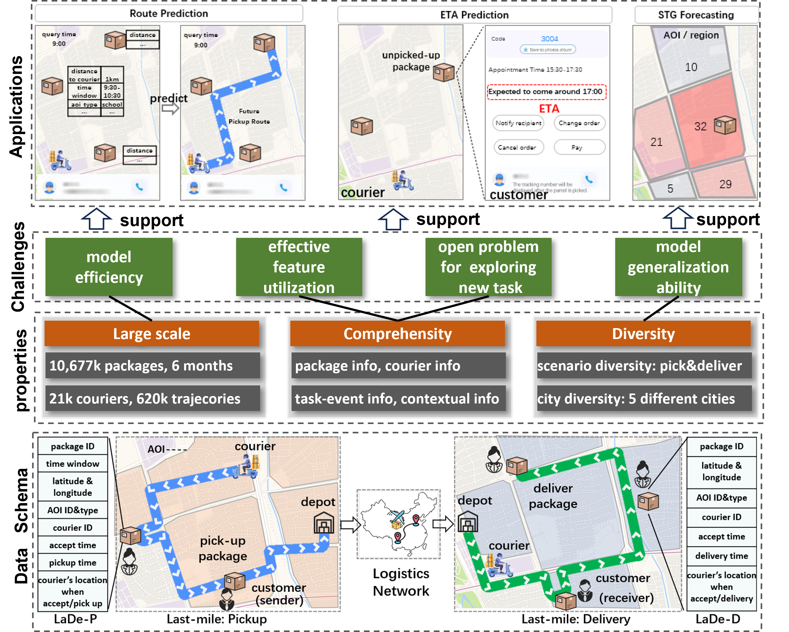
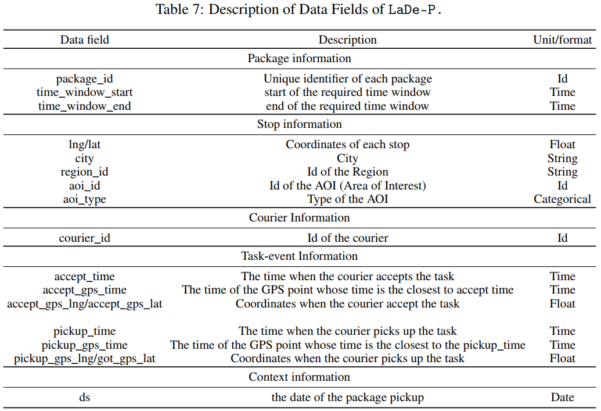
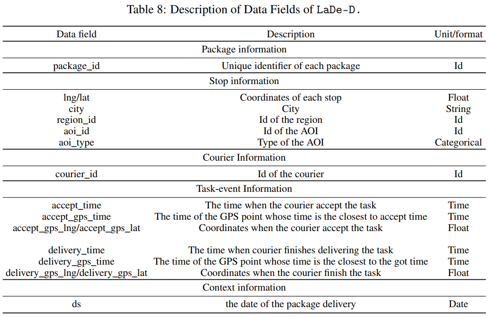

# LaDe: The First Comprehensive Last-mile Delivery Dataset from Industry


Data Link: [LaDe-P](https://huggingface.co/datasets/Cainiao-AI/LaDe-P) and [LaDe-D](https://huggingface.co/datasets/Cainiao-AI/LaDe-D)  
Paper Link: https://arxiv.org/abs/2306.10675
## 1 Abstract
Real-world last-mile delivery datasets are crucial for research in logistics, supply chain management, and spatio-temporal data mining. 
Despite a plethora of algorithms developed to date, no widely accepted, publicly available last-mile delivery dataset exists to support research in this field. 
In this paper, we introduce LaDe, the first publicly available last-mile delivery dataset with millions of packages from the industry. 
LaDe has three unique characteristics: (1) Large-scale. It involves 10,677k packages of 21k couriers over 6 months of real-world operation. 
(2) Comprehensive information. It offers original package information, such as its location and time requirements, as well as task-event information, 
which records when and where the courier is while events such as task-accept and task-finish events happen. 
(3) Diversity. The dataset includes data from various scenarios, including package pick-up and delivery, and from multiple cities, 
each with its unique spatio-temporal patterns due to their distinct characteristics such as populations. 
We verify LaDe on three tasks by running several classical baseline models per task. 
We believe that the large-scale, comprehensive, diverse feature of LaDe can offer unparalleled opportunities to researchers in the supply chain community, data mining community, and beyond.

### Overview of our work



## 2 Dataset Download
LaDe is composed of two subdatasets: i) [LaDe-D](https://huggingface.co/datasets/Cainiao-AI/LaDe-D), which comes from the package delivery scenario.
ii) [LaDe-P](https://huggingface.co/datasets/Cainiao-AI/LaDe-P), which comes from the package pickup scenario. To facilitate the utilization of the dataset, each sub-dataset is presented in CSV format.

LaDe can be used for research purposes. Before you download the dataset, please read these terms. Then put the data into "/data/raw/".  
The structure of "/data/raw/" should be like:  
```
* /data/raw/  
    * delivery    
        * delivery_sh.csv   
        * ...    
    * pickup  
        * pickup_sh.csv  
        * ...  
```

Each sub-dataset contains 5 csv files, with each representing the data from a specific city,  the detail of each city can be find in the following table.


|   City     |  Description                                                                                  |
|------------|----------------------------------------------------------------------------------------------|
| Shanghai   | One of the most prosperous cities in China, with a large number of orders per day.           |
| Hangzhou   | A big city with well-developed online e-commerce and a large number of orders per day.        |
| Chongqing  | A big city with complicated road conditions in China, with a large number of orders.          |
| Jilin      | A middle-size city in China, with a small number of orders each day.                          |
| Yantai     | A small city in China, with a small number of orders every day.                               |


## 3 Data Description
Below is the detailed field of each sub-dataset.
### 3.1 LaDe-P



### 3.2 LaDe-D


## 4 Code
Code for tasks on Cainiao-LaDe (Last-mile Delivery dataset).

*route_prediction*: code for route prediction task

*stg_prediction*: code for spatio-temporal graph forecasting.

*time_prediction*: code for estimated time of arrival (ETA) prediction. 

For the detailed running instructions of each task, plese see the corresponding readme in its directory.


## Cite
If you find this helpful, please cite our paper:
```shell
@misc{wu2023lade,
      title={LaDe: The First Comprehensive Last-mile Delivery Dataset from Industry}, 
      author={Lixia Wu and Haomin Wen and Haoyuan Hu and Xiaowei Mao and Yutong Xia and Ergang Shan and Jianbin Zhen and Junhong Lou and Yuxuan Liang and Liuqing Yang and Roger Zimmermann and Youfang Lin and Huaiyu Wan},
      year={2023},
      eprint={2306.10675},
      archivePrefix={arXiv},
      primaryClass={cs.DB}
} 
```